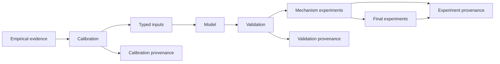

# Repository architecture

## Purpose

The repository implements an interpretable agent-based model of DAI stability
under collateral-price stress. Economic mechanics, empirical inputs,
calibration, validation and experiments are separate scientific layers. The
model remains intentionally narrower than the full Maker protocol.

## Authoritative package

The installable package is `src/dai_sim/`:

| Package | Responsibility |
| --- | --- |
| `model/` | Vault, collateral, price, liquidation, confidence, DAI-market and simulation mechanics |
| `inputs/` | Typed configuration, registry resolution and empirical runtime adapters |
| `calibration/` | Statistical estimation, identification, uncertainty and adoption decisions |
| `validation/` | Frozen-input, profile, accounting and cross-layer contract checks |
| `experiments/mechanism/` | Controlled pre-final causal studies |
| `experiments/final/` | Pre-registered final programme and completed Experiment A |
| `experiments/` root modules | Protected established scenario runners, summaries and plots |
| `common/` | Shared repository-path infrastructure |

The temporary flat compatibility modules were removed during repository
restructuring. `src/dai_sim/` is the only packaged source namespace.



The model does not depend on acquisition workflows. Validation does not feed
outcome-selected values back into calibration.

## Protected scientific paths

The integrated ETH and multi-collateral validation implementations remain at
`dai_sim.calibration.integrated_eth_validation` and
`dai_sim.calibration.multicollateral_validation`. Their current scientific
identity functions hash the historical relative source and workflow paths.
The semantic `dai_sim.validation` modules delegate to those implementations
without duplicating logic.

Confidence scenario values remain owned solely by
`config/sensitivities/confidence_scenarios.yaml`. Typed loading and activation
are owned by `dai_sim.inputs.confidence_scenarios`; mechanism/evidence checks
are owned by `dai_sim.validation.confidence_scenarios`. The old experiment
module is retained only as an identity-protecting import surface.

The registered ETH recovery and constrained ETH recovery studies are
mechanism experiments under `dai_sim.experiments.mechanism`. The root
`runner`, `scenarios`, `summaries` and `plots` modules remain protected
interfaces for established Experiments 1–6. They are not the destination for
the final experiment programme.

## Empirical domains

Empirical material is organised by Maker-facing domain:

```text
data/<domain>/{raw,processed,model_inputs,provenance}/
workflows/<domain>/
sql/<domain>/{templates,generated}/
```

The domains are `market`, `gas`, `vaults`, `liquidations` and
`protocol`. Aligned market–gas environment blocks are market-owned because
their row identity is defined jointly. Liquidation transaction gas is
liquidation-owned because the observation unit is a liquidation transaction.

## Configuration

Complete profiles live in `config/profiles/`. Partial treatment and scenario
registries live in `config/sensitivities/`; fixed protocol mappings live in
`config/protocol/`.

The final multi-collateral configuration has three value owners:
`final_collateral_registry.yaml` owns collateral and exact-ilk values,
`final_portfolio_registry.yaml` owns five portfolios, and
`final_shock_registry.yaml` owns seven result-blind shocks. The stable family
is explicitly counterfactual. None replaces the established stylised
multi-collateral experiment.

## Workflows and SQL

Acquisition, processing, reconstruction, input construction and calibration
entry points live under semantic workflow directories. Input-validation CLIs
remain under `workflows/inputs/`; the integrated and multi-collateral
workflow bytes are registered scientific-identity inputs. Registered recovery
CLIs live under `workflows/experiments/mechanism/`. The final programme
workflow under `workflows/experiments/final/` owns pre-registration,
checkpoint operation and evidence reconstruction for Experiment A.

Hand-maintained SQL lives in `sql/<domain>/templates/`. Executed historical
or deterministic generated SQL lives in `sql/<domain>/generated/`.

## Behavioural compatibility

The legacy ETH-only path remains the default. Multi-collateral inputs are
normalised to collateral-specific price mappings and long-format attribution,
while established system outputs remain compatible. The final opt-in
multi-collateral contract uses one globally ranked keeper capacity across all
collateral pools.

## Further reading

- [Visual project structure](project_structure.md)
- [Scientific package taxonomy](scientific_package_taxonomy.md)
- [Package audit](project_structure_audit.md)
- [Repository guide](repository_guide.md)
- [Model mechanics](../model/README.md)
- [Regression validation](../validation/regression.md)
- [Restructuring specification](../repository_restructuring_specification.md)
