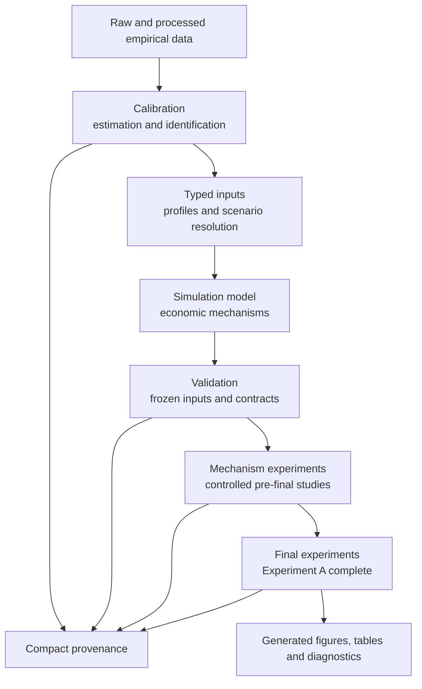

# Project structure

This is the implemented repository map after completion of the first final
multi-collateral experiment. It distinguishes scientific roles,
authoritative inputs and generated outputs.

## 1. Scientific architecture



Calibration may conclude that a parameter is unidentified; it does not need to
produce a point estimate. Validation checks frozen compositions and
cross-layer behaviour without estimating values. Mechanism experiments test
controlled causal effects. The final package owns the principal hierarchical
dissertation programme; Experiment A is complete and Experiment B is next.

## 2. Actual repository tree

```text
dai-abm-simulation/
├── config/
│   ├── profiles/                    complete opt-in profiles
│   ├── protocol/                    protocol and collateral registries
│   └── sensitivities/               treatment and scenario registries
├── data/
│   ├── {market,gas,vaults,liquidations,protocol}/
│   │   ├── raw/                     generated or local acquisition
│   │   ├── processed/               generated transformations
│   │   ├── model_inputs/            compact runtime inputs
│   │   └── provenance/              domain records
│   └── provenance/
│       ├── calibration/
│       ├── validation/
│       └── experiments/
├── src/dai_sim/
│   ├── model/                       economic state transitions
│   ├── inputs/                      typed profile and registry resolution
│   ├── calibration/                 estimation and identification
│   ├── validation/                  frozen-input and contract validation
│   ├── experiments/
│   │   ├── mechanism/               ETH recovery studies
│   │   ├── final/                   final programme and Experiment A
│   │   └── {runner,scenarios,summaries,plots}.py [protected established]
│   └── common/                      shared repository infrastructure
├── workflows/
│   ├── {market,gas,vaults,liquidations,protocol}/
│   ├── calibration/
│   ├── inputs/                      input-validation entry points
│   ├── experiments/mechanism/
│   ├── experiments/final/
│   └── maintenance/
├── tests/
│   ├── {model,inputs,calibration,validation}/
│   ├── experiments/{mechanism,final}/
│   ├── workflows/
│   └── integration/
├── docs/
│   ├── {overview,model,data,calibration,validation,experiments}/
│   └── archive/
├── sql/<domain>/{templates,generated}/
└── outputs/{experiments,diagnostics,figures,tables}/
```

Optional empty directories are not created for visual symmetry.

## 3. Scientific workflow

```mermaid
flowchart LR
    A["Empirical acquisition<br/>complete"]
    B["Calibration and typed inputs<br/>complete"]
    C["Integrated ETH validation<br/>complete"]
    D["Mechanism recovery studies<br/>complete"]
    E["Multi-collateral input validation<br/>complete"]
    T["Scientific package taxonomy<br/>complete with protected exceptions"]
    F["Experiment A<br/>complete"]
    B2["Experiment B<br/>next"]
    G["Held-out validation<br/>pending"]
    H["Code freeze<br/>pending"]

    A --> B --> C --> D --> E --> T --> F --> B2 --> G --> H
```



The final programme retains separate registered, operational and generated
evidence boundaries. Experiment A changes no production default; its next
unambiguous boundary is Experiment B under the frozen master programme.

## 4. Ownership map

| Object | Canonical owner | Other appearances |
| --- | --- | --- |
| Collateral and exact-ilk definitions | `config/protocol/final_collateral_registry.yaml` | Typed objects and validation evidence |
| Portfolio treatments | `config/sensitivities/final_portfolio_registry.yaml` | Validation CSV |
| Shock treatments | `config/sensitivities/final_shock_registry.yaml` | Validation CSV |
| Confidence scenario values | `config/sensitivities/confidence_scenarios.yaml` | Input resolver and validation evidence |
| Confidence scenario resolution | `dai_sim.inputs.confidence_scenarios` | Historical experiment import surface delegates |
| Confidence scenario checks | `dai_sim.validation.confidence_scenarios` | Compact evidence consumers |
| Keeper execution profiles | `config/sensitivities/keeper_execution.yaml` | Input resolver and calibration evidence |
| Vault runtime pool | `data/vaults/model_inputs/initialisation/` | Input loader |
| Market and network-gas pool | `data/market/model_inputs/environment_blocks/` | Input sampler |
| Liquidation arrivals | `data/liquidations/model_inputs/arrival/` | Input process |
| Shared liquidation ranking | `dai_sim.model.liquidation.rank_liquidation_candidates` | Validators call the model owner |
| Sustained recovery metrics | `dai_sim.experiments.mechanism.eth_recovery._recovery_metrics` | Constrained study imports the same owner |
| Integrated ETH validation API | `dai_sim.validation.integrated_eth` | Protected implementation remains under calibration |
| Multi-collateral validation API | `dai_sim.validation.multicollateral` | Protected implementation remains under calibration |
| Final experiment code | `dai_sim.experiments.final` | Master programme and completed Experiment A |
| Evidence manifests | `data/provenance/{calibration,validation,experiments}/manifest.json` | Cross-class provenance index |

Values, typed resolution, economic application and scientific validation are
separate ownership layers. A validation copy of a registry is evidence, not a
second configuration owner.

## 5. Protected paths and generated outputs

The integrated ETH and multi-collateral validator implementations remain at
`src/dai_sim/calibration/*_validation.py` because their scientific-code
identities include those relative paths and their input-validation workflows.
The semantic `dai_sim.validation` interfaces delegate to those frozen
implementations. The historical confidence-scenario experiment import remains
for the same integrated-profile identity boundary. Established
`runner.py`, `scenarios.py`, `summaries.py` and `plots.py` remain public
historical interfaces for Experiments 1–6.

Compact provenance remains authoritative. Large diagnostics, checkpoints,
result rows, figures and tables under `outputs/` are generated and ignored.
No generated artefact was removed or regenerated during this structural pass.

See the [complete package audit](scientific_package_taxonomy.md) and the
[decision report](project_structure_audit.md).
