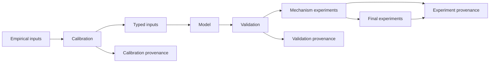

# Scientific package taxonomy

## Result

**Classification: `scientific_package_taxonomy_ready_with_protected_exceptions`.**

The active boundaries are now explicit:

- `calibration/` answers what empirical value, range or identification status a
  parameter should have;
- `validation/` checks frozen inputs, profiles and cross-layer contracts;
- `inputs/` resolves registered values into typed runtime objects;
- `experiments/mechanism/` contains controlled pre-final causal studies; and
- `experiments/final/` is the sole destination for the unimplemented
  dissertation experiment programme.

Two registered validators and one historical confidence-scenario import
surface remain at older paths because path strings and source bytes participate
in scientific identities. They are listed below and do not create competing
value owners.

## Definitions

### Calibration

Calibration covers estimation, empirical transformations, partial
identification, parameter uncertainty and adoption decisions. It does not
include scenario execution, portfolio comparisons or frozen-profile
validation.

### Validation

Validation tests whether a frozen input, profile or model contract reconciles
as intended. It includes distributional checks, accounting reconciliation,
shared-capacity checks and price isolation. It does not estimate parameters.

### Mechanism experiment

A mechanism experiment uses a controlled treatment design to test whether one
causal mechanism changes an outcome. It may own a treatment matrix, common
random numbers, replications, hypotheses, contrasts and compact experiment
evidence.

### Final experiment

A final experiment directly answers the principal multi-collateral research
questions. Idiosyncratic diversification, stress correlation, the stable
collateral trade-off and shared keeper-capacity crowding will enter only
`dai_sim.experiments.final`.

### Scenario or input resolution

Input resolution chooses a frozen registry value or profile and returns its
typed representation. A value does not become an experiment merely because an
experiment consumes it.

## Implemented package tree

```text
src/dai_sim/
├── calibration/                   parameter estimation and identification
│   ├── integrated_eth_validation.py      [protected historical implementation]
│   └── multicollateral_validation.py     [protected historical implementation]
├── validation/
│   ├── confidence_scenarios.py    mechanism and evidence validation
│   ├── integrated_eth.py          semantic interface to protected owner
│   └── multicollateral.py         semantic interface to protected owner
├── experiments/
│   ├── mechanism/
│   │   ├── eth_recovery.py
│   │   └── constrained_eth_recovery.py
│   ├── final/
│   │   └── __init__.py            reserved implementation boundary
│   ├── confidence_scenarios.py    [protected historical import surface]
│   ├── runner.py                  [protected established experiments]
│   ├── scenarios.py               [protected established scenarios]
│   ├── summaries.py               [protected established reporting]
│   └── plots.py                   [protected established rendering]
├── inputs/
│   └── confidence_scenarios.py    typed registry and scenario resolution
├── model/
└── common/

tests/
├── calibration/
├── validation/
│   ├── test_confidence_scenarios.py
│   ├── test_integrated_eth.py
│   └── test_multicollateral.py
├── inputs/
│   └── test_confidence_scenario_resolution.py
├── experiments/
│   └── mechanism/
│       ├── test_eth_recovery.py
│       └── test_constrained_eth_recovery.py
├── model/
├── workflows/
└── integration/

workflows/
├── calibration/
├── experiments/
│   └── mechanism/
│       ├── eth_recovery.py
│       └── constrained_eth_recovery.py
├── inputs/                         protected input-validation entry points
└── maintenance/
```

No empty test or workflow directory was added merely for symmetry. The source
`experiments/final/` boundary is intentionally present before final
implementation.

## Current-to-target migration

| Previous path | Current semantic path | Decision |
| --- | --- | --- |
| `experiments/eth_recovery.py` | `experiments/mechanism/eth_recovery.py` | Safe move; registered code identity is frozen independently of this path |
| `experiments/constrained_eth_recovery.py` | `experiments/mechanism/constrained_eth_recovery.py` | Safe move; registered code identity is frozen independently of this path |
| `workflows/experiments/eth_recovery.py` | `workflows/experiments/mechanism/eth_recovery.py` | Safe workflow move |
| `workflows/experiments/constrained_eth_recovery.py` | `workflows/experiments/mechanism/constrained_eth_recovery.py` | Safe workflow move |
| `experiments/confidence_scenarios.py` | `inputs/confidence_scenarios.py` plus `validation/confidence_scenarios.py` | Safe responsibility split; old import surface retained for one path-hashed caller |
| `calibration/integrated_eth_validation.py` | semantic API `validation/integrated_eth.py` | Protected implementation path; no evidence rewrite |
| `calibration/multicollateral_validation.py` | semantic API `validation/multicollateral.py` | Protected implementation path; no evidence rewrite |
| `tests/calibration/test_confidence_scenarios.py` | `tests/inputs/test_confidence_scenario_resolution.py` plus `tests/validation/test_confidence_scenarios.py` | Split by tested responsibility |
| `tests/integration/test_integrated_empirical_eth.py` | `tests/validation/test_integrated_eth.py` | Validation test move |
| `tests/integration/test_multicollateral_integration.py` | `tests/validation/test_multicollateral.py` | Validation test move |
| `tests/experiments/test_*_recovery.py` | `tests/experiments/mechanism/` | Mechanism-test move |

## Experiment-directory audit

### Python source

| Current path | Imports and callers | Scientific role | Matrix / provenance / identity | Action |
| --- | --- | --- | --- | --- |
| `experiments/__init__.py` | Package import only | Package boundary | None | Updated description |
| `experiments/confidence_scenarios.py` | Imports the input and validation owners; called only by the unchanged integrated profile | `historical_protected_exception` | Preserves the current integrated-ETH source identity; owns no registry value | Retained as a delegating import surface |
| `experiments/mechanism/__init__.py` | Package import only | Package boundary | None | Added |
| `experiments/mechanism/eth_recovery.py` | Consumes calibration event paths, input scenarios and model confidence/market mechanics; workflow and tests call it | `mechanism_experiment` | Owns the 16-cell matrix, CRN seeds, recovery outcomes, contrasts and registered evidence; identity remains `bcae5ed6…` | Moved |
| `experiments/mechanism/constrained_eth_recovery.py` | Consumes the integrated profile, keeper inputs, scenario resolver and ETH recovery metric; workflow and tests call it | `mechanism_experiment` | Owns the 24-cell matrix, hypotheses, paired evidence and identity `17ace2eb…` | Moved |
| `experiments/final/__init__.py` | No caller yet | Final implementation boundary | No experiment exists | Added; deliberately empty of business logic |
| `experiments/runner.py` | Calls model, scenarios and summaries; public API and established docs call it | `historical_protected_exception` / mechanism runner | Runs established Experiments 1–6; frozen Experiments 1–5 depend on it | Retained |
| `experiments/scenarios.py` | Imported by the established runner and registered structural evidence | `scenario_input` / `historical_protected_exception` | Historical scenario factories; a registry records this path | Retained |
| `experiments/summaries.py` | Imported by the established runner | `shared_metric` / reporting | Established summary schema and recovery reporting | Retained |
| `experiments/plots.py` | Consumes established result files | `workflow_only` / rendering | Produces figures, not parameter estimates | Retained |

The recovery modules run simulations and own experiment matrices; neither
estimates a parameter. The confidence input module runs none. The established
runner executes historical experiments but is not the destination for the
final hierarchical programme.

### Workflows and tests

| Current path | Classification | What it does | Action |
| --- | --- | --- | --- |
| `workflows/experiments/mechanism/eth_recovery.py` | `workflow_only` | Dispatches registered recovery operations; owns no scientific equation | Moved |
| `workflows/experiments/mechanism/constrained_eth_recovery.py` | `workflow_only` | Dispatches the constrained study and evidence reconstruction | Moved |
| `tests/experiments/mechanism/test_eth_recovery.py` | `test_only` | Protects design, CRN, outcomes, metrics, evidence and workflow interface | Moved |
| `tests/experiments/mechanism/test_constrained_eth_recovery.py` | `test_only` | Protects cells, capacity treatments, hypotheses, evidence and workflow interface | Moved |

### Experiment documentation

| Path | Classification and caller | Action |
| --- | --- | --- |
| `docs/experiments/README.md` | Navigation for all established and mechanism studies | Updated taxonomy |
| `baseline.md` | Historical mechanism-experiment record; linked by the index | Retained |
| `oracle_delay.md` | Historical mechanism-experiment record; linked by the index | Retained |
| `shock_severity.md` | Historical mechanism-experiment record; linked by the index | Retained |
| `confidence.md` | Historical mechanism-experiment record; linked by the index | Retained |
| `peg_recovery.md` | Historical mechanism-experiment record; linked by the index | Retained |
| `multi_collateral.md` | Historical stylised multi-collateral experiment, not the final programme | Retained as protected history |
| `confidence_scenarios.md` | Scenario-input and validation record | Updated owner links |
| `eth_recovery_matrix.md` | Registered mechanism-experiment record | Updated source/workflow links |
| `constrained_eth_recovery.md` | Registered mechanism-experiment record | Updated source/workflow links |

These Markdown files import nothing and run nothing. Their callers are the
documentation indexes, status documents and link-validation suite.

## Calibration and validation audit

All calibration implementation modules were inspected. `adoption`,
`confidence_evidence`, `data_loading`, `event_simulation`, `gas`,
`identification`, `keeper_execution`, `liquidations`, `market`,
`partial_identification`, `protocol`, `simulated_moments`,
`simulated_moments_diagnostics`, `simulated_moments_search`, `statistics`,
`structural_factorial`, `structural_incompatibility`, `validation` and
`vaults` estimate, identify, review or adopt candidate parameters and therefore
remain correctly under `calibration/`. In particular,
`calibration/validation.py` validates candidate-estimation evidence; it is not
a frozen-profile validator.

The two exceptions are:

| Historical implementation | Actual role | Protection |
| --- | --- | --- |
| `calibration/integrated_eth_validation.py` | Frozen integrated-profile and dynamic contract validation | Its current code identity hashes this path, `inputs/integrated_profile.py`, `model/liquidation.py` and `workflows/inputs/validate_integrated_eth.py` |
| `calibration/multicollateral_validation.py` | Frozen portfolio, shock, price-isolation and shared-capacity validation | Its registered identity hashes this path, two model/input owners and `workflows/inputs/validate_multicollateral.py` |

The semantic modules in `dai_sim.validation` delegate to these path-protected
implementations; they do not duplicate behaviour or values.

At the start and end of this pass, the integrated implementation recomputed
the same current-source identity
`61df5a3602a4d3a8cbe177f8e98d0f0ac67b1b2fcecc670a335eea25391c39f8`.
Its compact v1 evidence retains the earlier registered historical identity
`f88cdf57e23bca4e56bb768fc0bb6767978d0649419f4d16fbfa964701aa2f4e`;
that pre-existing distinction follows an earlier manifest-only maintenance
change and was neither repaired nor obscured here. The multi-collateral
identity remained
`4e514cad4deac4cd32cd7e2c4c3d9fec83f52688d80ade9a7760262a08712632`.

All remaining tests under `tests/calibration/` cover estimation,
identification, evidence or adoption. The former confidence-scenario test was
split because it did not test calibration.

All five `workflows/inputs/validate_*.py` files are user-facing validation
entry points for resolved inputs: environment, vaults, liquidations,
integrated ETH and multi-collateral. They remain together because the latter
two workflow bytes are scientific-identity inputs. This convention is
explicit: `workflows/inputs/` owns input-validation commands;
`src/dai_sim/validation/` owns validation semantics.

## Confidence-scenario ownership

`config/sensitivities/confidence_scenarios.yaml` remains the sole value owner.
`dai_sim.inputs.confidence_scenarios` owns dataclasses, source-domain checks,
registry loading, coupled transforms, typed activation and metadata.
`dai_sim.validation.confidence_scenarios` owns the bounded mechanism smoke,
deterministic evidence reconstruction, atomic evidence writing and provenance
validation. It filters its four owned records within the shared experiment
manifest and preserves unrelated recovery records during writes. The
historical experiment import surface contains no value or validation
implementation.

## Recovery metrics

`experiments.mechanism.eth_recovery._recovery_metrics` remains the protected
canonical owner of sustained recovery, peg-band membership, restricted mean
time, censoring, first return and failed attempts for both registered recovery
studies. Moving it would disturb a protected experiment implementation for no
behavioural benefit. The integrated validator’s shorter consecutive-band gate
is validation-specific, and `experiments.summaries` retains the established
Experiment 5 reporting contract. Final experiments must import the mechanism
owner until a separately pre-registered metric migration is authorised.

## Protected exceptions

1. The two validator implementations remain under `calibration/`; their new
   semantic modules are interfaces, not second implementations.
2. `experiments/confidence_scenarios.py` remains because changing the unchanged
   integrated-profile import would alter its current path-and-bytes identity.
3. The established `runner`, `scenarios`, `summaries` and `plots` remain at the
   experiment root because public imports, documentation and frozen
   Experiments 1–5 depend on them.
4. Input-validation workflows remain under `workflows/inputs/` because two are
   identity inputs. New non-input validation workflows may use
   `workflows/validation/` when a real implementation exists.
5. No shared recovery-metric extraction was attempted because the registered
   mechanism owner is already unambiguous.

## Dependency flow



Validation may call the model and typed inputs, but it does not feed a
validation outcome back into parameter estimation. Final experiments are not
implemented in this pass.
